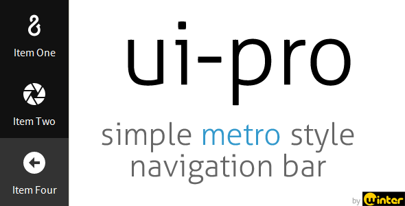
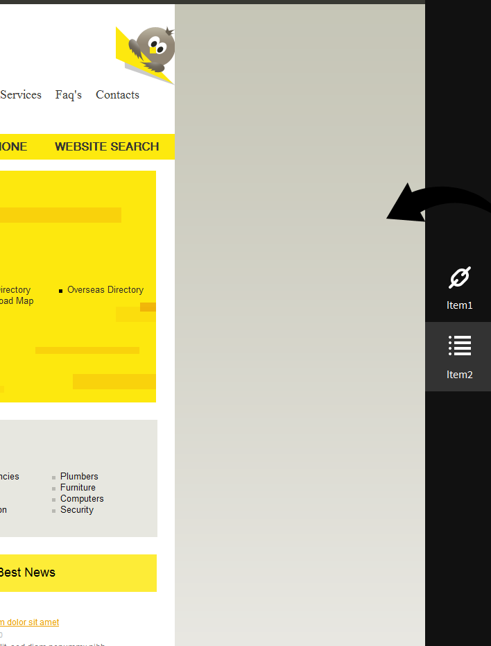

# Warning

This repository is not maintained, it is only here for historical reasons. It was originally sold on CodeCanyon.

# uipro - jQuery Plugin - 2012

Demo: [https://wintercounter.github.io/uipro](https://wintercounter.github.io/uipro)

<h3>Description</h3>
With this simple <strong>jQuery Plugin</strong> you can easily create <strong>Metro</strong> (now simply called Windows 8 UI) style navigation bars. The plugin package comes with the icon pack called <strong>iconic</strong> created by <strong>P.J. Onori</strong>, which you can easily set with CSS classes. This plugin has minimal features and options, it has been created for webmasters who need similar functionality on their site(s).

<h3>Features</h3>
<ul>
<li>Metro UI style navigation bar</li>
<li>Includes 249 Styleable Icons as icon font (using FontAwesome)</li>
<li>Uses CSS3</li>
<li>Lightweight JS/CSS</li>
<li>HTML or Object source</li>
<li>Left or/and Right panel</li>
<li>Easy customization</li>
</ul>